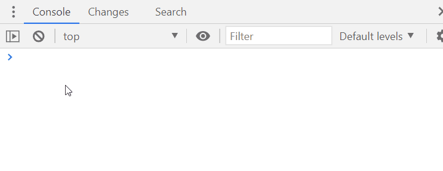

How many times a day you go to [jwt.io](https://jwt.io) just to paste a JWT token and decode it?

With this devtools plugin you can finally decode a JWT token directly from your console.

Just type these two lines:

```javascript
import("//r8s.io")
re.jwtDecode(JWT_TOKEN)
```

## Introduction
A JWT token is a string that can be used to authorize a user for accessing APIs.

Today it is one of the most used technologies to implement session-less web services.

The power of a JWT token resides in 3 things:
1) a jwt token is signed (using a password known only by the backend) and cannot be modified;
2) the front-end can inspect the token data easily
3) it's easy to debug by a human

With this plugin you can inspeft any JWT token with a line of code.

## Use case #1: decode a JWT token saved in the localStorage
Usually in a webapp, when a user logs in successfully the HTTP response returns a token.

When the token is a JWT, usually it resides in the `localStorage` and is saved
with a name similar to `TOKEN`.

In this scenario, you can easily inspect the token with this code:

```javascript
re.jwtDecode(localStorage.TOKEN)
```



## Use case #2: inspect the JWT token metadata (the header)
A JWT token header contains several information about:
- the token algorithm used to sign the content
- the expiration date
- the issuer of the token

To inspect the token header just type:

```javascript
re.jwtDecode.header(THE_TOKEN)
```

## Contribute to this open source project
The jwtDecode plugin and the whole ReDevTools projects are open source.

You can find the source code of this plugin at

[https://github.com/redevtools/redevtools/tree/main/plugins/](https://github.com/redevtools/redevtools/tree/main/plugins/)


