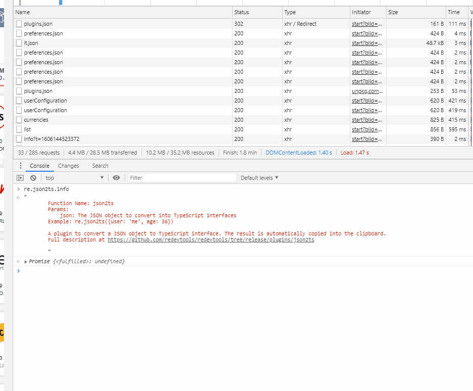

If you use TypeScript regularly, you love to be typesafe.
Always. Also with the JSON files that come from your backend.

**Did you search “convert JSON to typescript interfaces” before?**

I know. I know. You search for it just to:
- copy the JSON into the tool
- convert to TypeScript
- paste the interfaces back to your code

Would not be awesome to just type `json2ts(your_json)` into the console?

With the **json2ts plugin**, you can convert a JSON object to TypeScipt interfaces
directly from the console.

As for any redevtools plugin, just open the console and type:

```javascript
import("//r8s.io")
re.json2ts(yourJsonData)
```

This will print the interfaces.

But we didn't stop here. What would be your next step?

Maybe to select the whole text and copy it to the clipboard?

Well, we got you covered: the result is **automatically copied into the clipboard**, 
ready to be pasted into your IDE.


## Use case #1: transform a HTTP JSON response to TypeScript interface

Often the developer needs to extract the interfaces from a backend response.

You can do this by:

1) Click on the request in the Network panel
2) Right click on the response (in the Preview tab)
3) Select Store as variable from the menu
4) type `re.json2ts(temp1)` into the console

See how it works:




## Contribute to this open source project
The json2ts plugin and the whole ReDevTools projects are open source.

This plugin in particular was inspired by the code of Gregor Biswanger
at [https://github.com/GregorBiswanger/json2ts](https://github.com/GregorBiswanger/json2ts)


You can find the source code of this plugin at

[https://github.com/redevtools/redevtools/tree/main/plugins/](https://github.com/redevtools/redevtools/tree/main/plugins/)


