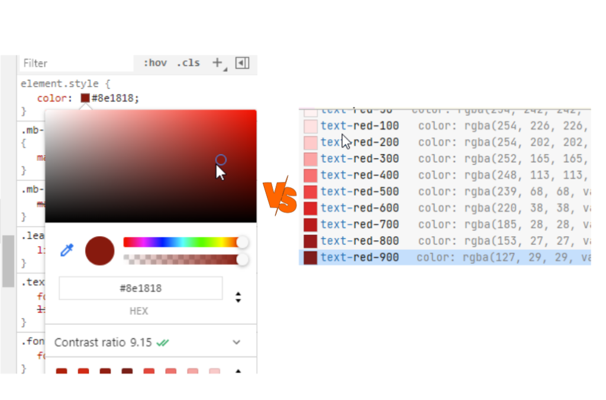
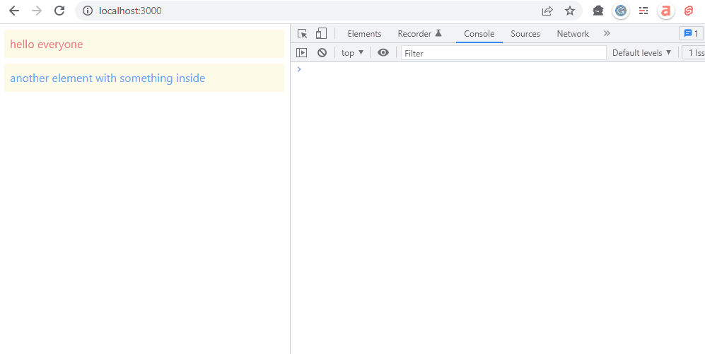
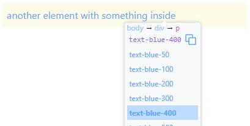
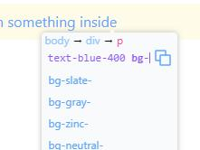
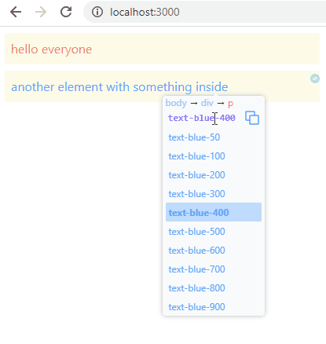
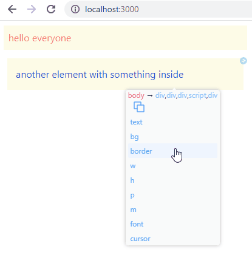

## Update Feb 2022

After almost a year, here we are with a new and improved version of the tailwind devtool:

- completely rewritten
- no-install: you don't need a Chrome extension anymore since you already have it in your console (see below)
- blazing fast

The best part of this new version is that you don't need to install it.

Just type `import("//r8s.io")` in the console, then `ALT + t` (or `Opt + t` on a MAC)

Then start inspecting: use the keyboard or better use your mouse (fast fast fast with the scroll wheel ;-) )


## Why a tailwind devtool
Tailwind is a great technology, but it can be hard to approach it for the first time:

- Chrome does not suggest Tailwind classes
- Remembering them can be difficult

### The problem with Tailwind and Chrome
Chrome does a great job to help you edit styles and elements and see changes live in your browser.
Unfortunately, when using Tailwind, you have classes with fixed colors and sizes:
it is difficult to edit them from the Style Element Panel. The style panel is designed
to edit CSS rules rather than “class rules”:
 


We need a tool to work with discrete values.

Tailwind Devtools Inspector is an extension that lets you solve this problem.

And best of all, it is **available from your console without installing anything**

## Quick Install
Tailwind devtools Inspector can be accessed from your console.

It is part of redevtools, so you don't have to install anything: just type this snippet in your console: 

```javascript
import("//r8s.io")
```

and you're ready.

To enable the inspector you can type `ALT + t` (or `Opt + t` on a MAC).

Remember: to enable redevtools you just have to type `import("//r8s.io")` in your console, but if you want it already available at page startup, 
then add this snippet into your project:

```javascript
// on the development environment
if(window.location.href.indexOf("localhost") >= 0){ //customize it to your needs
    document.head.appendChild(document.createElement("script")).src = "//r8s.io"
} 
    
```
That's all.

## Always-on mode
If you are a mouse GUI and don't like using the `ALT + t` / `Opt + t` hotkey, then we got you covered.
There is a quicker **always-on mode**: type:

```javascript
re.tailwind() // enable/disable always on mode
```

and you'll see a small little icon close to any element to quickly edit it without using the keyboard.



It may seem disturbing at the beginning, but you'll love it after a few minutes!

## The Tailwind Devtools Inspector main features
So here we are: a tool into your console to speed up your work with Tailwind.

Main features:


#### Preview and add classes on any element


#### Autocomplete for tailwind classes


#### Easy with your mouse and keyboard
To switch between classes you can go UP and DOWN with your keyboard.
Or you can use your mouse wheel and see changes instantly:



#### Jump to parent, child element
You can use the breadcrumb to quickly jump to the parent element or one of the children



#### And more
- open-source (GitHub)[https://github.com/butopen/redevtools/tree/main/packages/tailwind-devtools-inspector], 
- free 
- lightweight: 8KB gzipped - just the essential bits needed to let you work faster with Tailwind. 


## Contribute
Tailwind Devtools is open source. You can contribute to the project in several ways:

(https://github.com/butopen/redevtools/tree/main/packages/tailwind-devtools-inspector)[https://github.com/butopen/redevtools/tree/main/packages/tailwind-devtools-inspector]
- Suggest improvements or problems
- Help with coding through GitHub

## Join us
Join our mailing list and receive updates about the Tailwind Devtools extensions and more ReDevtools plugins to speed up the front-end development
